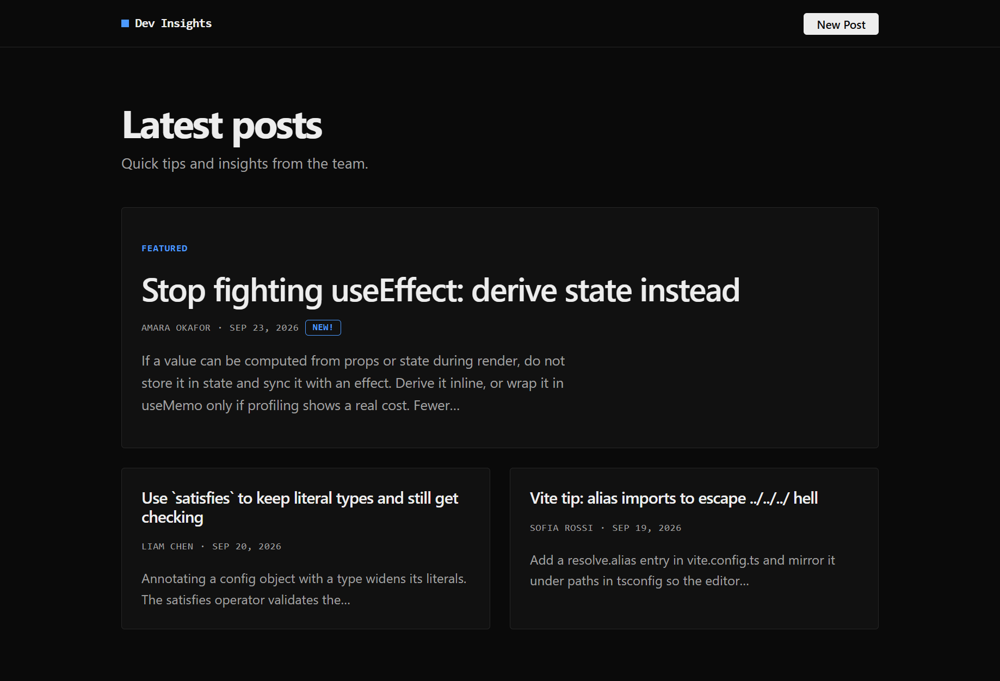

# Dev Insights: Mini Blog

Internal blog for sharing quick web-development tips. Built with **React 19 + TypeScript**, bundled with **Vite**.



## Features

- `Header` (text logo, "New Post" link), `PostList`, `Post`, `App`
- Fully typed `Post` interface, no `any`
- Conditional styling: first post is **featured** (larger, full width); posts under 24 h old show a **New!** badge
- `React.memo` + unique `key`s, and a `withLogger` HOC (mount/unmount logs)
- Responsive grid, automatic dark mode

## Tech stack

**Vite**, React 19, TypeScript, CSS Modules, styled-components, ESLint.

## Structure

```
src/
├── components/  Header, PostList, Post, Badge (+ .module.css)
├── hoc/         withLogger.tsx
├── data/        posts.ts (sample posts)
├── types/       post.ts (Post interface)
├── utils/       date.ts, text.ts
├── App.tsx, global.css, main.tsx
docs/screenshot.png
```

## How to Run

Requires Node ≥ 20.19.

```bash
git clone https://github.com/shina227/react-dev-formative-1.git
cd react-dev-formative-1
npm install
npm run dev
npm run build
npm run preview
```

**Testing:** there is no automated test suite. `npm run lint` and `npm run build` (strict `tsc`) must pass, then check manually:
- **HOC:** console shows `[Post] mounted` per post. In dev, StrictMode intentionally mounts → unmounts → remounts once, so each is logged twice (dev only).
- **memo:** React DevTools → Components shows `Memo(withLogger(Post))`. Add a temporary `useState` counter in `App`, record in the Profiler with *"Record why each component rendered"*, and click it: `Post` shows "Did not render".

## Design decisions

**Functional vs class.** `Post` is functional: it is a pure function of props with no state or lifecycle, so a class would add `this` and boilerplate, lose hooks, and need `PureComponent` for what `memo` does. The class pattern lives in `withLogger`, where `componentDidMount`/`componentWillUnmount` map directly onto the mount/unmount logging. Data is passed down as props (`App` → `PostList` → `Post`) from `data/posts.ts` so `PostList` stays reusable.

**Styling.**
- *CSS Modules* for most styling: scoped, zero runtime, real CSS, driven by variables in `global.css`.
- *styled-components* for `Badge` only: a small self-contained element. Trade-off: the library is in maintenance mode and adds a runtime dependency, so this is a deliberate, scoped choice; `Badge` is trivial to migrate to a CSS Module.
- Inline styles are not used: they can't express pseudo-classes, media queries or theme tokens.

**Optimization.**
- `React.memo` on `Post`: when a parent re-renders with unchanged props, unchanged posts skip rendering and re-truncating. It is the outermost wrapper, otherwise `withLogger`'s class wrapper would re-render with its parent.
- `key={post.id}`: reconciliation matches items by identity, not position, so inserting a post mounts only the new one instead of remounting or mutating the wrong instances.
- `withLogger` adds behaviour without changing `Post` and composes with `memo`, showing that wrapper order matters.

## Challenges

- **StrictMode double logs** looked like an HOC bug; traced to StrictMode's dev-only remount check rather than removing it.
- **Verifying `memo`:** nothing re-renders without state, so I used a temporary counter and the Profiler.
- **`truncate` edge cases:** cuts at a word boundary, keeps a word ending exactly at the limit, handles one very long word, and strips trailing punctuation before "…".
- **Stale demo data:** sample dates are generated relative to load time so the "New!" badge always demonstrates correctly; dates format in UTC to avoid off-by-one days.
- **HOC typing:** `Readonly<P>` isn't assignable to `P`; one commented cast avoids `any`.

## Dependencies

- **Runtime:** `react`, `react-dom`, `styled-components`
- **Dev:** `vite`, `@vitejs/plugin-react`, `typescript`, `@types/react`, `@types/react-dom`, `@types/node`, `eslint`, `@eslint/js`, `typescript-eslint`, `eslint-plugin-react-hooks`, `eslint-plugin-react-refresh`, `globals`